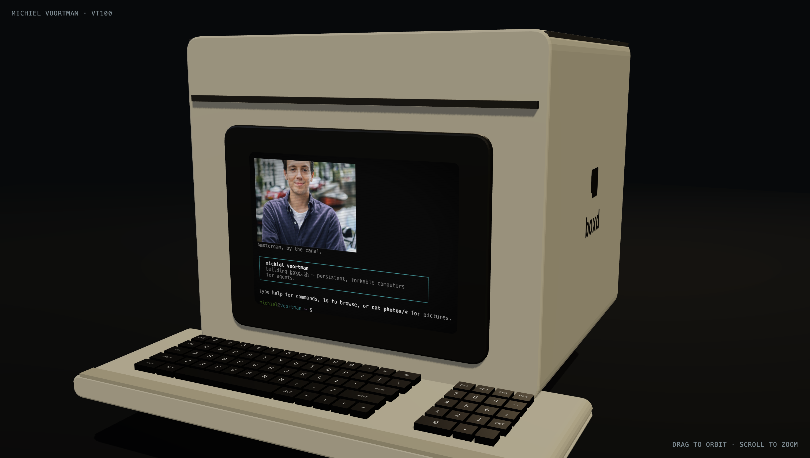

# michielvoortman.boxd.sh

[](https://michielvoortman.boxd.sh/)

> **Live:** [michielvoortman.boxd.sh](https://michielvoortman.boxd.sh/)

A personal site that's actually a computer.

The home page is a 3D VT100 you can orbit, zoom, and type on. The CRT shows a real terminal — `ls`, `cat`, `help`, all of it — backed by a PTY shell over WebSocket. The keyboard isn't decorative: clicking a 3D keycap sends the keystroke to the shell, and typing on your real keyboard depresses the matching key in 3D. The same `boxd` shell can later drive a physical VT100 over serial.

Touch the engraved `boxd` logo on the side of the case. You'll see.

## Two routes

- **[`/`](https://michielvoortman.boxd.sh/)** — 3D VT100 with the live portfolio iframed inside the screen
- **[`/term`](https://michielvoortman.boxd.sh/term)** — the plain xterm.js page (same shell, no 3D wrapper)

## Stack

| | |
|---|---|
| 3D | Three.js (WebGL renderer + `CSS3DRenderer` for the iframe-as-screen) |
| Frontend | Vite + TypeScript + xterm.js (vanilla — no framework) |
| Shell | A tiny portfolio shell in TypeScript |
| Transport | `node-pty` ↔ `ws` ↔ xterm.js |

## Dev

```bash
npm install
npm run dev          # vite on :5173 + pty server on :8000 (vite proxies /pty)
```

Open <http://localhost:5173>.

## Production

```bash
npm run build
npm start            # serves dist/ on :8000 and the /pty WebSocket on the same port
```

The boxd proxy forwards `:8000` → `https://$BOXD_VM_NAME.boxd.sh`.

## Adding commands to the shell

Edit `server/shell.ts`. Each command is a `{ name, desc, run }` entry in the `commands` map. Keep output ANSI-only — no mouse events, no bracketed-paste tricks — so the same shell stays valid over a serial link to a physical terminal.

## Credits

Made with way too much fun together with [Claude Code](https://claude.com/claude-code).
